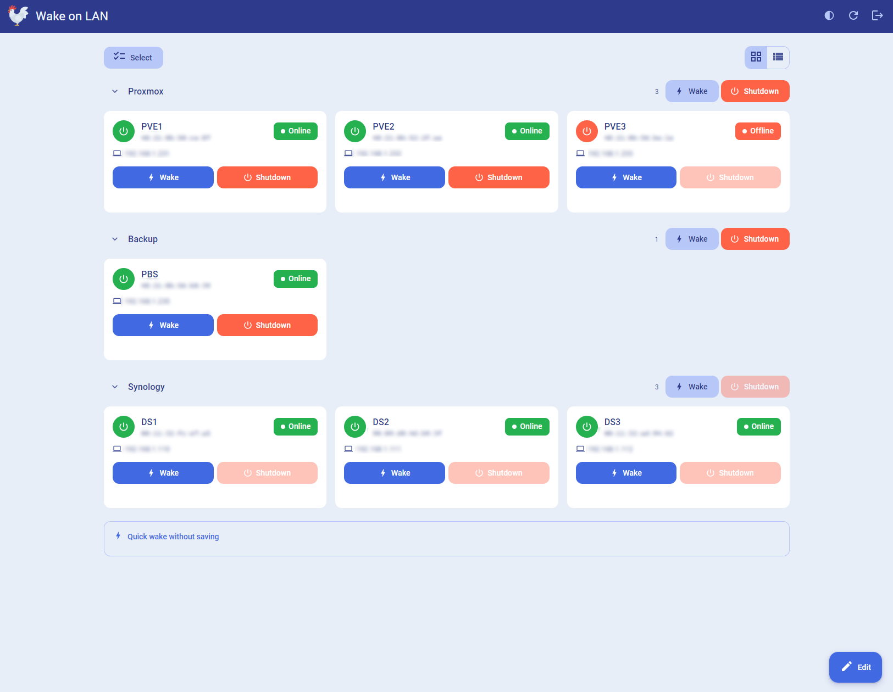
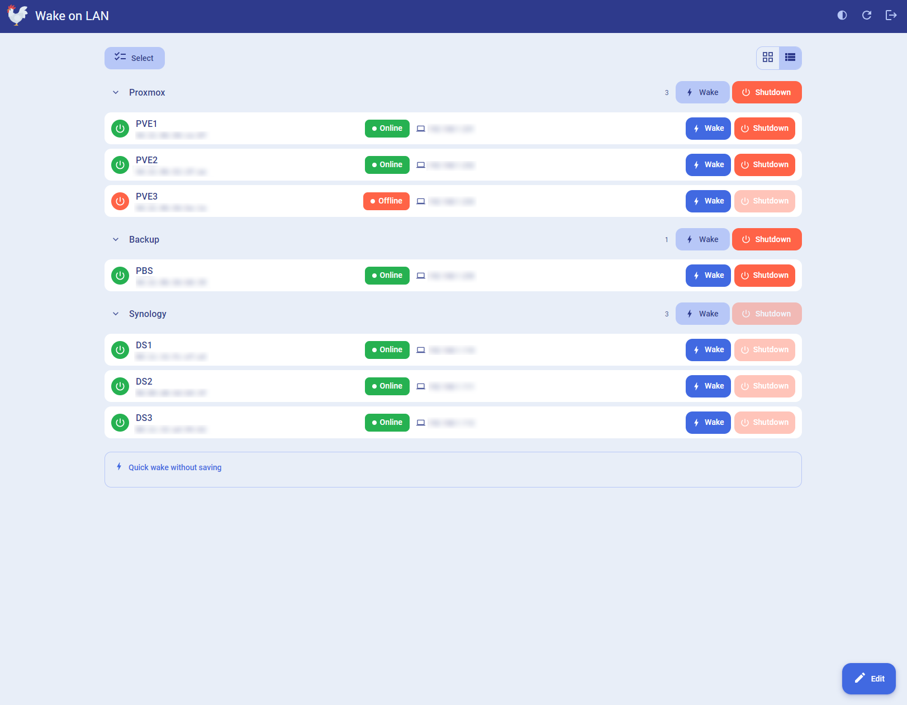

# Wake on LAN

Wake-on-LAN in a container, with two ways to use it:

* **Web mode** - a small web UI with a device list, online/offline status, wake and shutdown buttons, scheduled wake-ups, and a REST API.
* **CLI mode** - the original one-shot behaviour: send a magic packet and exit.

Magic packets are sent to both UDP port 9 and 7 and repeated a few times, which makes waking more reliable than a single packet.

> `--net=host` is required in both modes: broadcast packets cannot cross the Docker bridge network.

## Web mode
<p align="center">
   
  
</p>


```
docker run -d --name wake-on-lan --net=host \
  -e MODE=web \
  -e WEBUI_PASSWORD='choose-a-password' \
  -e TZ='Europe/Amsterdam' \
  -v /path/to/config:/config \
  ghcr.io/r0gger/docker-wake-on-lan
```

The UI is then available at `http://<host-ip>:8080`. Devices are stored in `/config/devices.json`, so mount that volume to keep them across restarts.

Or with Docker Compose:
```
services:
  wake-on-lan:
    image: ghcr.io/r0gger/docker-wake-on-lan
    container_name: wake-on-lan
    restart: unless-stopped
    # Host networking is required on Linux: broadcast packets do not cross the Docker bridge.
    # It also means port mappings are ignored, so PORT decides where the UI listens.
    # Docker Desktop (Windows/Mac) uses a VM: set each device's IP so packets are routed
    # to the LAN as unicast / directed broadcast instead of 255.255.255.255.
    network_mode: host
    environment:
      MODE: web
      PORT: 8099
      TZ: Europe/Amsterdam
      THEME: auto # Theme: auto, light or dark    
      WEBUI_PASSWORD: CHANGE-ME
      # Optional: token for the REST API (Home Assistant, scripts)
      # API_KEY: replace-with-a-long-random-string
    volumes:
      - ./config:/config
```

```
docker compose up -d
```

Host networking ignores port mappings, so `PORT` decides where the UI listens. The compose file uses `8099`, which means the UI is at `http://<host-ip>:8099`.

The UI uses Material 3 and includes a light and a dark theme. Styles and icons are bundled in the image, so it does not load fonts or scripts from the internet.

The button in the top-right corner cycles between following the system setting, light, and dark. That choice is stored in the browser, so it applies per device. `THEME` sets what a visitor sees before they pick a theme: `auto` (default), `light`, or `dark`.

### What the UI does

* Add devices with a name, MAC address, and optionally a hostname or IP.
* Status per device: a TCP connect on the configured ports (default 22, 3389, 445, and 80), with ping as a fallback. The indicator turns green when the device responds.
* Wake with feedback: if a host is set, the UI waits until the machine actually responds and reports how long it took.
* Remote shutdown: SSH (Linux/NAS), Windows RPC, or a Sleep-on-LAN magic packet. If a host is set, the UI waits until the machine goes offline.
* Schedule a wake-up with a cron expression, for example `0 7 * * 1-5` for every weekday at 07:00.
* Quick wake for a MAC address you do not want to save.
* Group devices into named sections. Collapse a section, wake or shut down the whole group, and drag devices between groups.
* Switch between card and list views. Groups stay available in both. The choice is stored in the browser.
* Select several devices and wake or shut them down together.
* Layout stays locked until you tap Edit. Save, or `EDIT_LOCK` seconds idle (default 300), locks add/edit/delete/drag again.

## CLI mode

The same as before, without a UI:

```
docker run --rm --name wake-on-lan --net=host -e MAC='11:11:11:11:11:11' ghcr.io/r0gger/docker-wake-on-lan
```

Multiple MAC addresses (space- or comma-separated):

```
docker run --rm --net=host -e MAC='11:11:11:11:11:11 22:22:22:22:22:22' ghcr.io/r0gger/docker-wake-on-lan
```

MAC addresses may be written as `11:22:33:44:55:66`, `11-22-33-44-55-66`, or `112233445566`. An invalid address stops the container with exit code 2 instead of silently doing nothing.

Wait until the machine is actually up (useful in scripts; exit code 1 if it stays offline):

```
docker run --rm --net=host \
  -e MAC='11:11:11:11:11:11' \
  -e WAIT_HOST='192.168.1.20' \
  -e WAIT_TIMEOUT=120 \
  ghcr.io/r0gger/docker-wake-on-lan
```

Command-line arguments work too and override the environment variables:

```
docker run --rm --net=host ghcr.io/r0gger/docker-wake-on-lan 11:22:33:44:55:66 -b 192.168.1.255 -r 5
```

## Environment variables

| Variable | Default | Description |
| --- | --- | --- |
| `MODE` | `auto` | `web`, `cli`, or `auto` (CLI when `MAC` is set, otherwise web) |
| `MAC` | - | one or more MAC addresses for CLI mode |
| `BROADCAST` | `255.255.255.255` | broadcast address, e.g. `192.168.1.255` |
| `REPEAT` | `3` | how often each packet is sent |
| `WAIT_HOST` | - | host to poll after waking (CLI mode) |
| `WAIT_TIMEOUT` | `0` | seconds to wait for that host |
| `OPTIONS` | - | legacy `awake` options; `-p` and `-b` are still honoured |
| `PORT` | `8080` | web UI port |
| `HOST` | `0.0.0.0` | web UI listen address |
| `CONFIG_DIR` | `/config` | where `devices.json` and the session key are stored |
| `THEME` | `auto` | default theme: `auto`, `light`, or `dark` |
| `EDIT_LOCK` | `300` | seconds of idle time before Edit mode locks again; `0` disables auto-lock |
| `AUTH_ENABLED` | `true` | set to `false` to run without a login |
| `WEBUI_PASSWORD` | - | password for the web UI |
| `API_KEY` | - | token for the REST API |
| `SECRET_KEY` | generated | Flask session key; generated and stored in `/config` if unset |
| `TZ` | `UTC` | timezone used by the schedules |
| `LOG_LEVEL` | `INFO` | `DEBUG`, `INFO`, `WARNING`, or `ERROR` |

The login screen only appears when `WEBUI_PASSWORD` is set:

* Neither `WEBUI_PASSWORD` nor `API_KEY` set: no login. The UI is open to everyone on the network, and a warning is logged at startup.
* `WEBUI_PASSWORD` set: login screen. The API also accepts `API_KEY` if you set one.
* Only `API_KEY` set: no login form, because there is no password to enter. The API stays protected and the browser shows a short explanation.

Changing these variables requires recreating the container, not just restarting it:

```
docker compose up -d --force-recreate
```

## REST API

Authenticate with the `X-API-Key` header, `Authorization: Bearer <key>`, or a `key` (or `api_key`) query parameter.

```
# List devices including status
curl -H "X-API-Key: $API_KEY" http://host:8080/api/devices

# Wake a saved device and wait until it responds
curl -X POST -H "X-API-Key: $API_KEY" -H 'Content-Type: application/json' \
     -d '{"wait": true, "timeout": 90}' \
     http://host:8080/api/devices/<id>/wake

# Shut down a saved device and wait until it goes offline
curl -X POST -H "X-API-Key: $API_KEY" -H 'Content-Type: application/json' \
     -d '{"wait": true, "timeout": 90}' \
     http://host:8080/api/devices/<id>/shutdown

# Wake an arbitrary MAC address
curl -X POST -H "X-API-Key: $API_KEY" -H 'Content-Type: application/json' \
     -d '{"mac": "11:22:33:44:55:66"}' \
     http://host:8080/api/wake
```

### Wake link

A browser can wake a saved device with a single GET. Set `API_KEY` and put it in the URL so you do not need to be logged in:

```
http://host:8099/api/devices/<id>/wake?key=$API_KEY
```

Open that address, bookmark it, or put it behind a button on another device. The browser shows a short confirmation page. `curl` and other clients that prefer JSON still get JSON.

The key will appear in browser history and server logs, so use a long random `API_KEY`. GET wake does not accept the web UI session, only the API key, so a logged-in browser cannot be tricked into waking a machine via a crafted link.

| Method | Path | Description |
| --- | --- | --- |
| `GET` | `/api/devices` | all devices including status, plus `groups` |
| `POST` | `/api/devices` | add a device |
| `PUT` | `/api/devices/<id>` | update a device |
| `PUT` | `/api/devices/<id>/move` | move a device to a group (`group_id`, `index`) |
| `DELETE` | `/api/devices/<id>` | delete a device |
| `GET` | `/api/devices/<id>/wake` | wake via a clickable link (`?key=`); API key required |
| `POST` | `/api/devices/<id>/wake` | wake, with `wait` and `timeout` |
| `POST` | `/api/devices/<id>/shutdown` | shut down, with `wait` and `timeout` |
| `GET` | `/api/groups` | all groups |
| `POST` | `/api/groups` | add a group |
| `PUT` | `/api/groups/<id>` | rename a group |
| `PUT` | `/api/groups/reorder` | set group order (`ids`) |
| `DELETE` | `/api/groups/<id>` | delete a group (devices become ungrouped) |
| `POST` | `/api/groups/<id>/wake` | wake every device in the group |
| `POST` | `/api/groups/<id>/shutdown` | shut down devices in the group that have shutdown configured |
| `POST` | `/api/wake` | wake a MAC address without saving it |
| `GET` | `/api/status` | status only; cheap to poll |
| `GET` | `/healthz` | health check; no authentication |

### Home Assistant example

```yaml
rest_command:
  wake_office_pc:
    url: http://192.168.1.10:8080/api/devices/abc123def456/wake
    method: POST
    headers:
      X-API-Key: !secret wol_api_key
  shutdown_office_pc:
    url: http://192.168.1.10:8080/api/devices/abc123def456/shutdown
    method: POST
    headers:
      X-API-Key: !secret wol_api_key
```

## Remote shutdown

Configure the method on each device. The password is stored in `devices.json` and is never sent back to the browser.

**SSH** needs a hostname and a user that can power the machine off without a prompt, for example passwordless sudo for `poweroff`. A password is optional: you can also mount a private key as `/config/id_ed25519` or `/config/id_rsa`. The default command is `sudo -n poweroff`.

**Windows (RPC)** uses `net rpc shutdown` over SMB (port 445). Use an administrator account, allow File and Printer Sharing through the firewall, and for a local account set `LocalAccountTokenFilterPolicy` to `1`.

**Sleep-on-LAN** sends a magic packet with the MAC bytes reversed. That requires [Sleep-on-LAN](https://github.com/SR-G/sleep-on-lan) on the target; this container does not need credentials.

## Notes

* Status checks use TCP first because ICMP inside a container requires root or `CAP_NET_RAW`. Devices without an open port fall back to ping.
* Broadcast on a different subnet than the Docker host usually needs the subnet broadcast address, for example `192.168.1.255`.
* Docker Desktop on Windows or Mac runs inside a VM, so `255.255.255.255` never reaches your LAN. Give the device its IP (or set the broadcast field to `192.168.1.255`); packets are then sent as unicast and directed broadcast, which the VM can route.
* The web login password is never written to disk; only its hash lives in memory for the lifetime of the container. Shutdown credentials are stored in `devices.json`.
